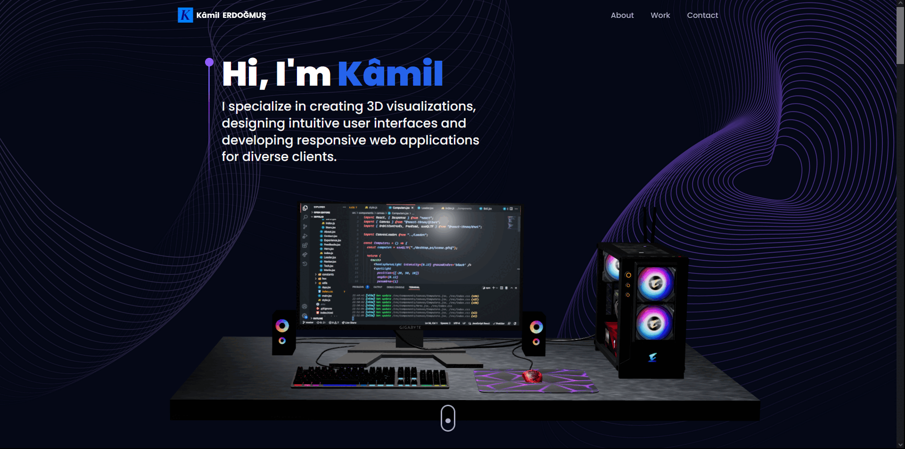

# 3D Web Developer Portfolio in React Vİte

## Description

This project showcases a portfolio for a 3D web developer, built using React and Vite. The portfolio highlights various projects and skills, leveraging modern web technologies to create an interactive and visually appealing experience.

## Features

- Interactive 3D models and animations
- Responsive design for seamless viewing on all devices
- Project showcase with detailed descriptions and links
- Contact form integration using EmailJS
- Smooth navigation and transitions with React Router and Framer Motion
- Timeline component to display career milestones

## Libraries

- **Tailwind**: For utility-first CSS styling.
- **@react-three/fiber**:For building and rendering 3D graphics with React.
- **@react-three/drei**:For useful helpers for 3D development.
- **maath:**:For advanced math utilities.
- **react-tilt**: For adding tilt effects to components.
- **react-vertical-timeline-component**:For creating vertical timelines.
- **emailjs/browser**: For integrating email services into the web app.
- **framer-motion**: For creating smooth animations and transitions.
- **react=router=dom**: For handling navigation and routing.

## Usage

- View Projects: Navigate to the main page to view a list of all showcased projects.
- Add New Project: Use the "Add Project" button to add a new project to the portfolio.
- Project Details: Click on any project to view detailed information and options to edit or delete the project.
- Search Functionality: Use the search bar to filter projects based on keywords.
- Contact Form: Fill out the contact form to get in touch with the developer.
- Career Timeline: View the career milestones and achievements in a vertical timeline format.

## Preview



## Deployment

The project is deployed and can be accessed [here](https://main--lighthearted-bunny-cb5955.netlify.app/). For the project to run smoothly, please follow the installation steps below to set it up locally.The project may behave differently across different browsers.

## Installation

To run the project locally, follow these steps:

1. Clone the repository:

```bash
git clone https://github.com/KamilErdogmus/3D-Portfolio.git
```

2. Navigate to the project directory:

```bash
cd your-repository
```

3. Install dependencies:

```bash
npm install
```

4. Start the development server:

```bash
npm start / npm run dev
```

5. Open your web browser and visit http://localhost:3000 to view the application.
